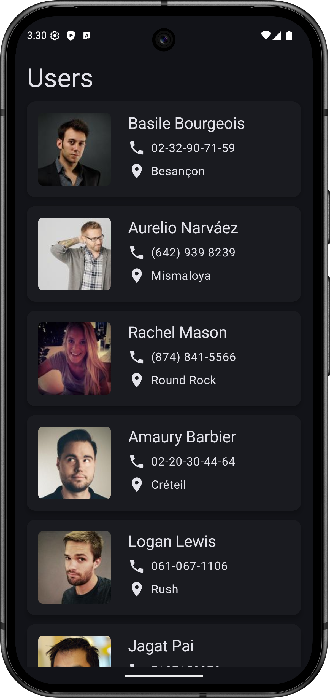

# Тестовое задание. Курс Android.

## Описание задачи

Реализовать Android-приложение со следующими функциями:
1. Выводится краткая информация о пользователях (ФИО, фотография, адрес, номер телефона) в виде списка, полученная от https://randomuser.me ;
2. По клику на элемент списка на отдельном экране показывается полная информация о выбранном пользователе;
3. Данные о пользователях не теряются при перезапуске приложения;
4. Нажатие на Email, номер телефона, адрес/координаты отправляет пользователя в приложение, которое может обработать эти данные (почта, звонилка, карты);
5. Список пользователей можно обновить принудительно;
6. Пользователю выводятся уведомления о возникших ошибках при загрузке данных или работе с ними.

---

## Скриншоты

  

---

## Используемые библиотеки

1. **UI** - Compose вместо View + Fragments т.к проще писать ui и работать со стейтом в декларативном стиле
2. **Сетевые запросы** - Retrofit т.к прост в использовании и стандарт в Android разработке
3. **Сериализация** - Kotlinx Serialization т.к помимо Retrofit используется в Navigation Compose
4. **DI** - Hilt, а не Dagger или Koin т.к не нужно писать много бойлерплейт кода и работает во время компиляции, соответсвенно нет рантайм ошибок.
5. **Кэширование данных** - Room т.к прост в использовании и имеет поддержку корутин
6. **Навигация** - Navigation Compose т.к официальное решение от гугл, есть интеграция с Hilt'ом
7. **Загрузка изображений** - Coil т.к проcто использовать с Compose

---

## Принятые решения

1. **Архитектура**
   MVVM + Clean Architecture и разделение на feature и core модули:
   - `app` - активити + настройка навигации и di модулей
   - `feature`
      -   `user-list` - фича списка пользователей
      -   `user-details` - фича подробной информации о пользователе
   - `core`
      - `ui` - тема и общиее ui элементы
      - `network` - сетевые запросы к API
      - `database` - база данных
   - `build-logic`
      - `convention` - плагины для переиспользования кода из build скриптов
2. **Навигация** - Каждый экран определяет собственный интерфейс роутера. В app модуле лежат имплементации роутеров использующие `GlobalRouter`, который использует `NavController` из `Navigation Compose` для открытия экранов
3. **Кэширование данных** - При первом запросе данных они загружаются из api и сохраняются в базу данных. При повторном запросе беруться из базы. При обновлении данные в базе данных перезаписываются на новые, полученные из api
4. **Обновление данных** - Можно обновить данные через pull to refresh
5. **Обработка ошибок** - При возникновении ошибок во время загрузки данных или во время их обновления пользователю показывается диалог с ошибкой.